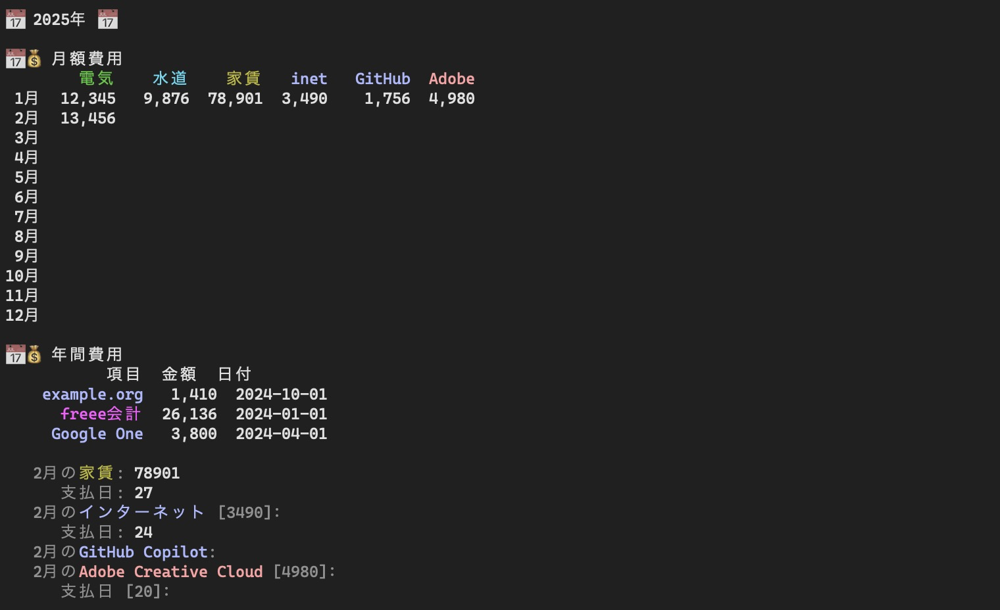

# freee-patrol👮‍♀️

Freee会計で毎月・毎年の費用を確認・入力するためのコマンドラインツールです。



## 機能

- 毎月の経費を確認・入力
- 毎年の経費を確認・入力

## 必要なもの

- Node.js v16（v20で動かない問題は調査中）

## 使い方

1. 最初の1回のみ `npm install` を実行
2. [Freee API スタートガイド](https://developer.freee.co.jp/startguide)に従い、アクセストークン取得ページまで辿り着く
3. 必要な情報を `.env` に記述
4. 経費の設定を `config.yaml` に記述
5. `npm start`

### コマンドラインオプション

`-year=2022` と指定することで、指定した年の経費を確認・入力できます。

```bash
npm start -year=2022
```

## `.env` の記述例

アクセストークン取得ページの URL は `https://app.secure.freee.co.jp/developers/start_guides/applications/${appId}/authorize?company_id=${companyId}` のようになっており、ここから `appId` と `companyId` をコピーして記述します。

```bash
# アプリID
FREEE_APP_ID=22222

# 事業所ID
FREEE_COMPANY_ID=1234567

# アクセストークン取得に使用する事業所ID
FREEE_AUTH_COMPANY_ID=2345678
```

## 経費の設定

`config.yaml` の記述例:

```yaml
# 事業所ID
company_id: 1234567
# デフォルト値
defaults:
  # 口座ID
  walletable_id: 4444444
  # 口座種別
  walletable_type: wallet
  # 税区分
  tax_code: 136 # 課対仕入10%
monthly:
  -
    name: 電気料金 # 表示名。「備考」に記入される
    slug: 電気 # 表形式の表示名
    color: green # 表示色
    min_day: 4 # この日以降、データがない場合は入力プロンプトを表示
    account_item_id: 56789012 # 勘定科目ID（省略可）
    item_id: 198765432 # 品目ID（省略可）
    partner_id: 3456789 # 取引先ID（省略可）
  -
    name: 水道料金
    slug: 水道
    color: cyan
    min_day: 8
    months: [1, 3, 5, 7, 9, 11] # 奇数月のみ
  -
    name: インターネット料金
    slug: inet
    color: lightBlue
    min_day: 24
    day: 31 # 指定するとデフォルト値として入力される
    amount: 3113 # 指定するとデフォルト値として入力される
yearly:
  -
    name: freee会計
    color: lightMagenta
    month: 4
    min_day: 9
    amount: 23760
```

- `color` …… blue, cyan, gray, green, magenta, red, yellow, lightBlue, lightCyan, lightGray, lightGreen, lightMagenta, lightRed, lightYellow のいずれか

### 設定ファイルに記述するIDを調べるためのスクリプト

- `npm run companies` …… 事業所一覧
- `npm run partners` …… 取引先一覧
- `npm run taxes` …… 税区分一覧
- `npm run wallets` …… 口座一覧

ほかに勘定科目IDと品目IDを調べる必要がありますが、まだ用意していません。

